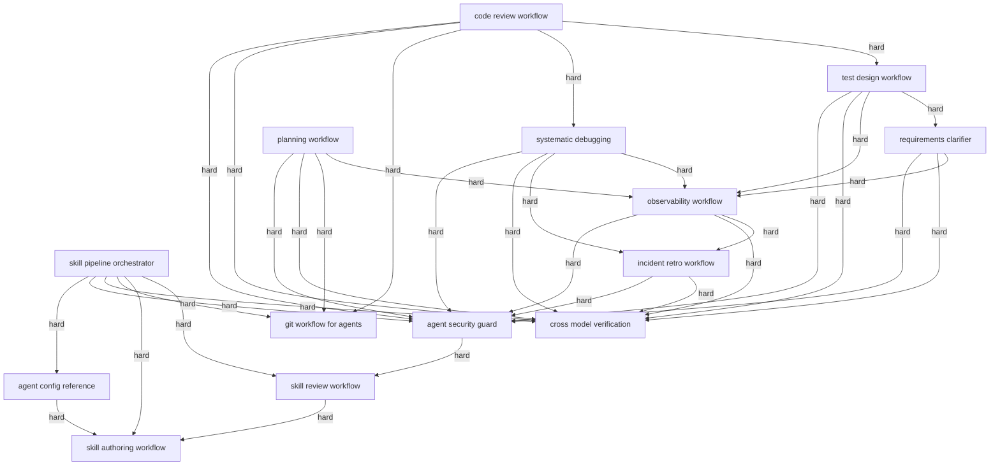

# Skill Graph Report: v3.0.0

- Nodes: 14
- Edges: 39
- Isolated skills: none
- Hard cycles: 0
- Missing stages: none

| Skill | Stages | Dependencies | Dependents | Risk |
|---|---|---|---|---|
| skill-authoring-workflow | author | none | agent-config-reference, skill-pipeline-orchestrator, skill-review-workflow | low |
| skill-review-workflow | review | skill-authoring-workflow | agent-security-guard, skill-pipeline-orchestrator | low |
| agent-security-guard | security | skill-review-workflow | code-review-workflow, incident-retro-workflow, observability-workflow, planning-workflow, requirements-clarifier, skill-pipeline-orchestrator, systematic-debugging, test-design-workflow | low |
| cross-model-verification | verify | none | code-review-workflow, incident-retro-workflow, observability-workflow, planning-workflow, requirements-clarifier, skill-pipeline-orchestrator, systematic-debugging, test-design-workflow | low |
| skill-pipeline-orchestrator | package, deploy | agent-config-reference, agent-security-guard, cross-model-verification, git-workflow-for-agents, skill-authoring-workflow, skill-review-workflow | none | low |
| git-workflow-for-agents | git | none | code-review-workflow, planning-workflow, skill-pipeline-orchestrator | low |
| agent-config-reference | configure | skill-authoring-workflow | skill-pipeline-orchestrator | low |
| code-review-workflow | code-review | agent-security-guard, cross-model-verification, git-workflow-for-agents, systematic-debugging, test-design-workflow | none | low |
| systematic-debugging | debugging | agent-security-guard, cross-model-verification, incident-retro-workflow, observability-workflow | code-review-workflow | low |
| test-design-workflow | testing | agent-security-guard, cross-model-verification, observability-workflow, requirements-clarifier | code-review-workflow | low |
| requirements-clarifier | requirements | agent-security-guard, cross-model-verification, observability-workflow | test-design-workflow | low |
| planning-workflow | planning | agent-security-guard, cross-model-verification, git-workflow-for-agents, observability-workflow | none | low |
| observability-workflow | observability | agent-security-guard, cross-model-verification, incident-retro-workflow | planning-workflow, requirements-clarifier, systematic-debugging, test-design-workflow | low |
| incident-retro-workflow | incident-retro | agent-security-guard, cross-model-verification | observability-workflow, systematic-debugging | low |
